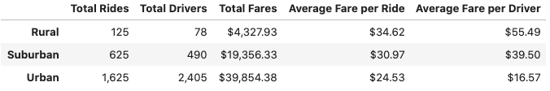
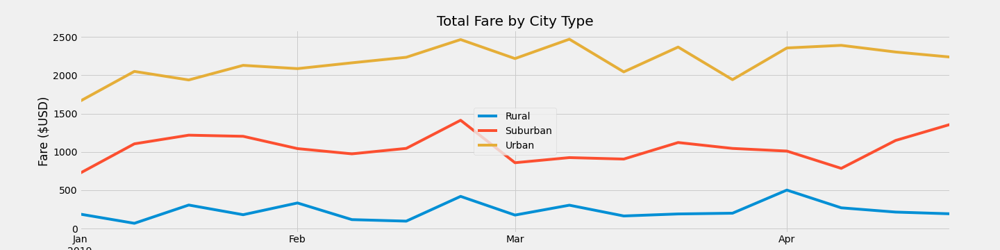

# PyBer_Analysis

## Overview
The purpuse of this analysis is to provide a summary of ride-share data from rural, suburban, and urban cities. Charts and graphs will be used to showcase the results. The analysis and visualizations were created in Jupyter lab with using Python with matplotlib and pandas.

## Results

## Summary
